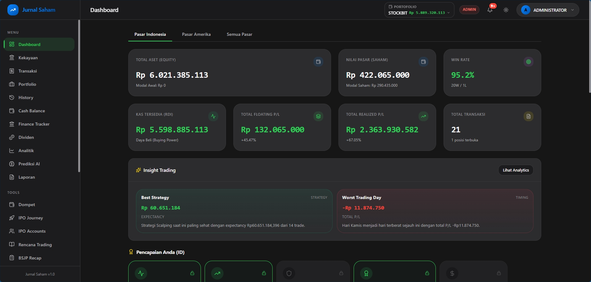
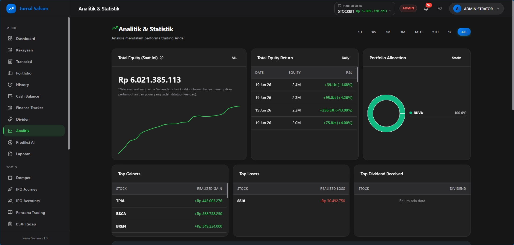
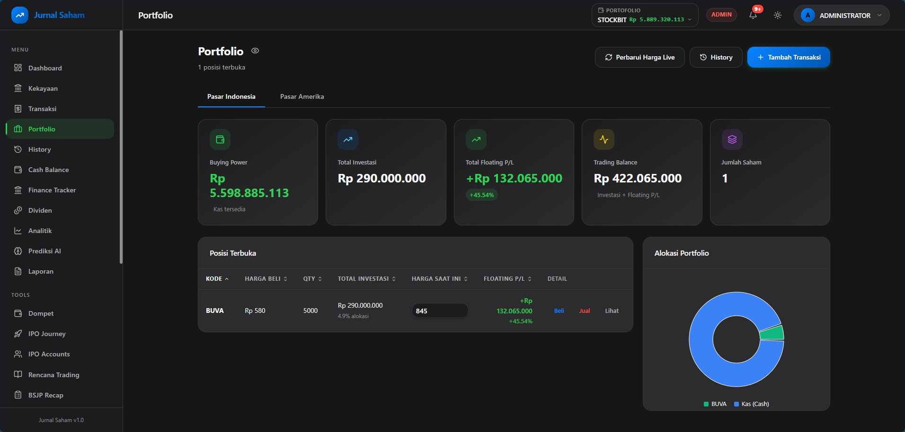
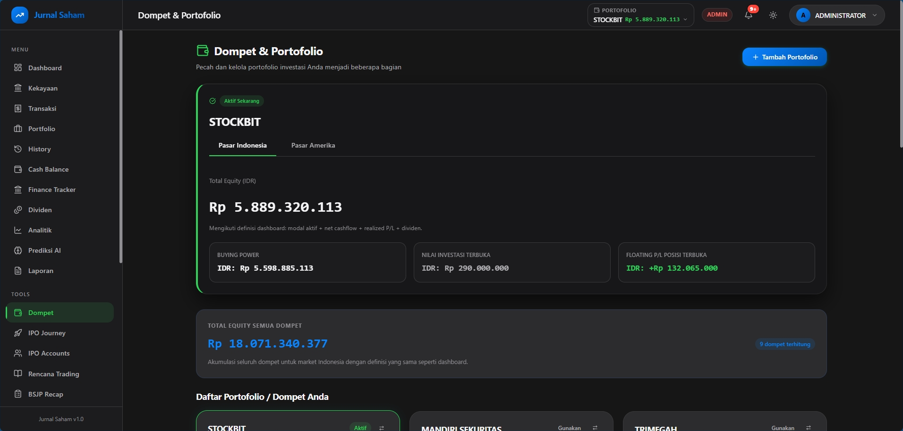
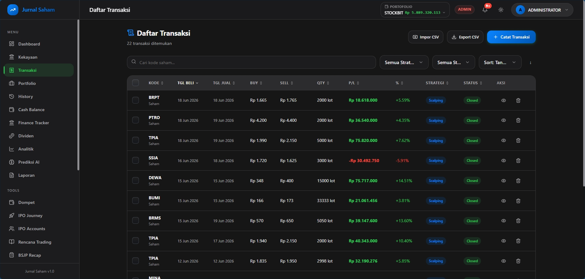
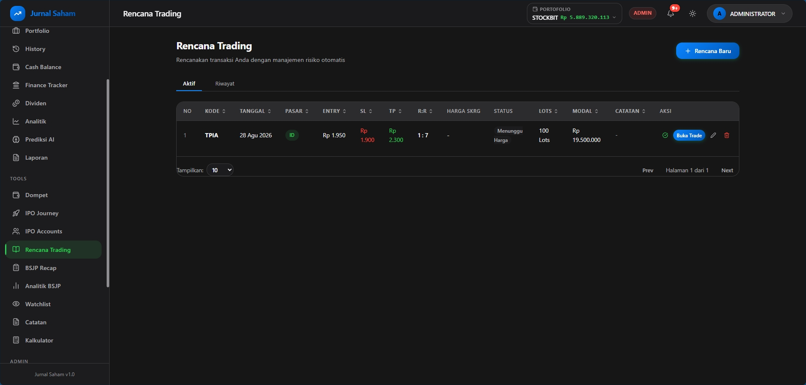
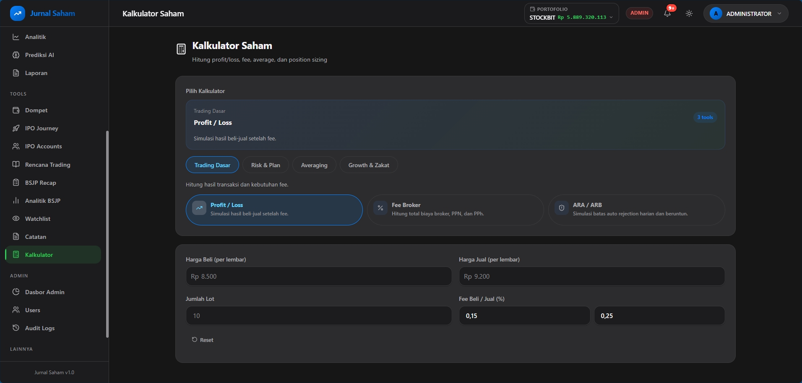

# 📈 Jurnal Saham

Jurnal Saham adalah aplikasi web komprehensif untuk mencatat, menganalisis, dan memantau perjalanan investasi saham Anda. Dibangun dengan teknologi web modern, aplikasi ini membantu *trader* dan investor untuk mengevaluasi portofolio, memantau pergerakan kas, serta membuat *trading plan* yang lebih terukur.

## ✨ Fitur Utama

- **📊 Dashboard & Analitik:** Ringkasan performa portofolio dan visualisasi data performa *trading* yang mudah dipahami.
- **💼 Portofolio & Dompet:** Pantau posisi saham (*holdings*) saat ini dan kelola alokasi saldo kas (*cash balance*) Anda.
- **📝 Jurnal Transaksi:** Catat setiap transaksi beli/jual secara detail beserta alasan *entry/exit* (buku catatan/*journaling*).
- **🎯 Trading Plan & IPO:** Buat rencana *trading* dan kalkulasi titik beli, target jual, serta *stop loss*. Pantau juga jadwal IPO terbaru.
- **🧮 Kalkulator Saham:** Hitung rata-rata harga (*average down*), persentase *profit/loss*, serta *money management*.
- **🔐 Autentikasi Aman:** Sistem *login* dan *role-based access* yang aman menggunakan Supabase.

## 📸 Tampilan Layar (Screenshots)

Berikut adalah *preview* antarmuka dari aplikasi Jurnal Saham:

### Dashboard & Analitik

*Ringkasan performa portofolio secara keseluruhan.*


*Visualisasi grafik performa dan statistik trading.*

### Portofolio & Keuangan

*Daftar saham yang sedang di-hold beserta floating profit/loss.*


*Manajemen saldo kas (cash balance) Anda.*

### Pencatatan & Perencanaan

*Halaman riwayat transaksi dan pencatatan jual/beli saham.*


*Perencanaan trading dengan kalkulasi Risk & Reward.*


*Kalkulator untuk menghitung average harga dan risk management.*

*(Lihat folder `docs/img/` untuk melihat kumpulan screenshot lengkap dari fitur-fitur lainnya seperti History, Watchlist, Laporan, dll).*

## 🚀 Teknologi yang Digunakan

Aplikasi ini dibangun menggunakan *stack* teknologi modern:
- **Frontend:** [React 19](https://reactjs.org/) + [Vite](https://vitejs.dev/) + [TypeScript](https://www.typescriptlang.org/)
- **Routing:** [React Router](https://reactrouter.com/)
- **Styling:** CSS Modern / [Tailwind CSS](https://tailwindcss.com/)
- **Charts/Grafik:** [Recharts](https://recharts.org/)
- **Backend & Database:** [Supabase](https://supabase.com/) (PostgreSQL & Authentication)
- **Ikon:** [Lucide React](https://lucide.dev/)

## 🛠️ Instalasi & Setup Lokal

Jika Anda ingin menjalankan proyek ini secara lokal di komputer Anda, ikuti langkah-langkah berikut:

1. **Clone repositori ini**
   ```bash
   git clone https://github.com/Ihsanshan27/jurnal-saham.git
   cd jurnal-saham
   ```

2. **Install dependensi**
   ```bash
   npm install
   ```

3. **Konfigurasi Environment Variables**
   Buat file `.env` di *root folder* proyek berdasarkan template yang ada:
   ```bash
   cp .env.example .env
   ```
   Lalu buka file `.env` dan masukkan kredensial project Supabase Anda:
   ```env
   VITE_SUPABASE_URL="https://YOUR_SUPABASE_PROJECT_URL.supabase.co"
   VITE_SUPABASE_PUBLISHABLE_KEY="YOUR_SUPABASE_PUBLISHABLE_KEY"
   ```

4. **Jalankan Development Server**
   ```bash
   npm run dev
   ```
   Buka `http://localhost:5173` di browser Anda untuk melihat aplikasinya berjalan.

## 🤝 Kontribusi

Repositori ini bersifat terbuka (*open-source*). Jika Anda menemukan *bug*, memiliki ide fitur baru, atau ingin berkontribusi, jangan ragu untuk membuat *Issue* atau *Pull Request*.
